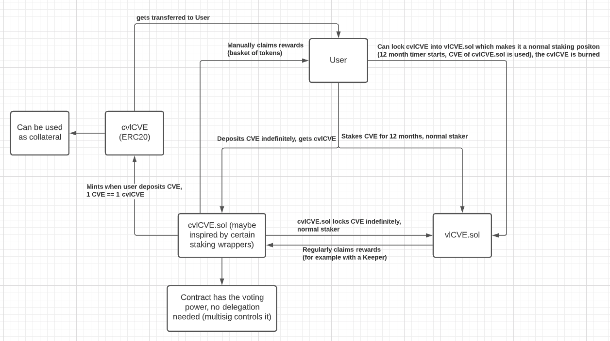

# cveCVE.sol

### Abstract

We want to offer the user a way to earn yield from staking CVE in `VotingEscrow.sol` while at the same time using it as collateral. We will facilitate this by introducing a wrapper that inherits from ERC-20 called `cveCVE.sol` that tokenizes veCVE.

With this approach we want to front run other protocols offering CVE specific wrappers to earn yield by staking CVE.

### Implementation

`transfer(address _to, uint256 _amount)`

Transfers ownership of `_amount` of cveCVE from sender to `_to`.

In the `_afterTokenTransfer` hook that is part of ERC-20, calls `updateReward` in `VotingEscrow.sol` for both sender and `_to` .

`unwrap(uint256 _amount)`

Converts cveCVE to veCVE by burning `_amount` of cveCVE and calling `lock` in `VotingEscrow.sol` to add `_amount` of veCVE to the sender's locked balance and start the 1 year unlock process.

`mint(address _account, uint256 _amount)`

Mints `_amount` of cveCVE to `_account` . Only callable by `VotingEscrow.sol` .

### Usage as Collateral

Regarding the usage as collateral, this leads to the following:&#x20;

* There will be a Curve pool to maintain the peg 1 CVE == 1 cveCVE and to allow swapping cveCVE for CVE
* There will be a Curvance pool that accepts cveCVE as collateral&#x20;
* If user gets liquidated, the liquidator seizes the collateral (cveCVE) and can either&#x20;
  * Swap it for CVE in our Curve pool (or any other asset on the secondary market)
  * Keep the cveCVE and continue to claim rewards
  * Stake his cveCVE into a vlCVE position with individual voting rights and 12 months lockup
* If the user does not get liquidated he can withdraw his collateral as usual

### Resources

#### Flowchart

